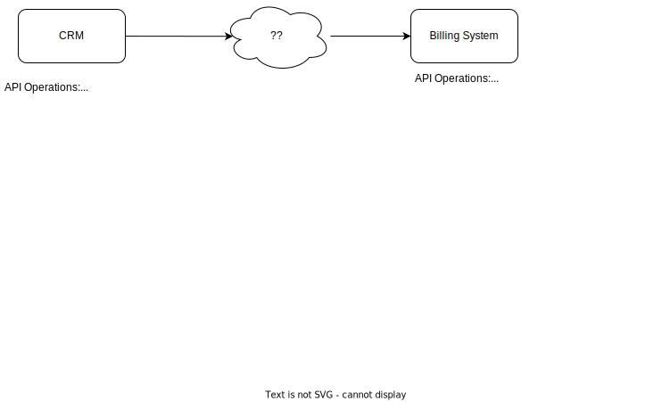

# Scenario: Customer Data Sync from CRM to Billing System

Our company uses two systems:

1. CRM System - Stores customer details, interactions, and correspodences. 
2. Billing System - Generates invoices and stores payment details.

Currently, these systems operate independently, leading to inconsistencies in customer data. For example, when a customer updates their email address in the CRM, it doesn't reflect in the Billing System, causing communication issues.

## Task:

Design an solution to integrate customer details between these two systems to ensure real-time data synchronization.

## System Details:

## Discussion Points:
* How would you ensure backward compatibility if one system changes?
* How would you test and validate the integration?
* What potential challenges do you foresee?